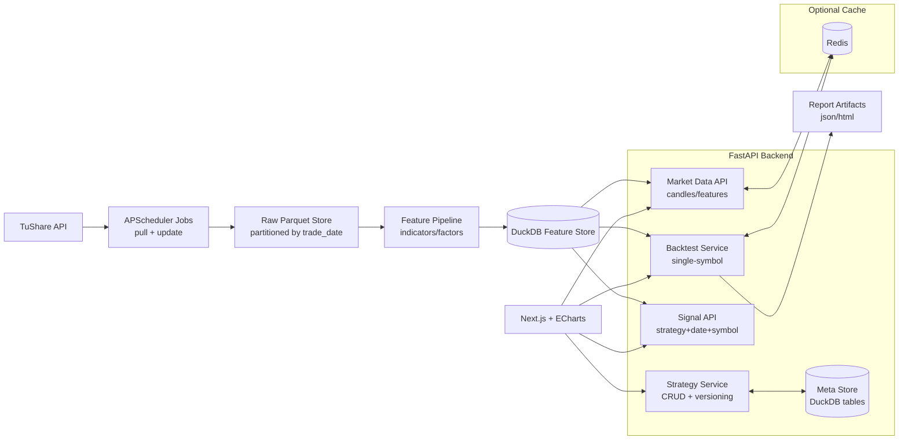

# Quant Platform（自用量化策略平台）

面向自用的 A 股天级别量化研究与回测平台：每日盘后自动拉取 TuShare 数据 → 生成特征/指标 → 策略发信号 → 单股回测 → 前端可视化（K 线 + 指标 + 交易点 + 回测报告）。

---

## 1. 目标与范围

### 1.1 目标（MVP）

- **数据闭环**：每日盘后拉取全市场股票日线行情 + daily_basic + 基础信息，落地到 **Parquet**，并可用 **DuckDB** 高效查询。
- **指标闭环**：计算一组常用技术指标与衍生特征，存入 Feature Store（DuckDB 表/视图）。
- **策略闭环**：策略管理（CRUD + 版本化），支持按 `strategy + date + symbol` 返回 `BUY/SELL/HOLD`。
- **回测闭环**：支持**单只股票**天级回测（默认 T 日收盘产生信号，T+1 开盘成交），输出关键绩效指标与交易明细。
- **前端展示**：股票列表、个股 K 线页（叠加指标/信号/交易点）、策略管理页、回测报告页。

### 1.2 非目标（后续迭代）

- 实盘交易（券商接入）、分钟级数据、组合回测/多标的回测、参数寻优、Walk-forward、因子库/横截面选股等。

---

## 2. 技术栈与组件

- **数据源**：TuShare（A 股）
- **存储/查询**：Parquet（原始与特征落地） + DuckDB（本地分析/查询引擎）
- **后端**：Python + FastAPI
- **定时任务**：APScheduler（盘后拉取、增量更新、指标计算）
- **缓存（可选）**：Redis（热点 K 线/指标、回测结果缓存、任务状态）
- **前端**：Next.js + ECharts
- **可观测性（建议）**：结构化日志 + 基础指标（后续可接 Prometheus/Grafana）

---

## 3. 总体架构



## 4. 功能需求（详细）

### 4.1 数据采集（盘后）

触发：每个交易日盘后（建议 16:30~18:00），以交易日历为准。
输入：TuShare token、交易日 trade_date。
输出：按日增量写入 Parquet，必要时写入 DuckDB 索引表。

采集内容（建议最小集）：

stock_basic：ts_code, name, industry, market, list_date, ...

daily（日线行情）：open, high, low, close, pre_close, change, pct_chg, vol, amount

daily_basic（估值/换手/市值等）：turnover_rate, volume_ratio, pe, pe_ttm, pb, ps, total_mv, circ_mv, ...

adj_factor（复权因子）

trade_cal（交易日历）

（可选增强）停复牌、涨跌停、公司行为（分红送转）等

#### 数据质量要求

幂等：重复运行同一天任务不会产生重复数据（按 ts_code + trade_date 去重/覆盖）。

可追溯：Raw 层不做业务改写，保留原始字段与拉取时间。

校验：行数对比（当日上市股票数量）、缺失率、字段类型检查。

### 4.2 指标/特征生成（Feature Pipeline）

触发：每日拉取完成后自动执行；也支持手动重算某一时间区间。
输入：Raw 层日线（建议使用复权收盘价进行部分指标计算）。
输出：写入 DuckDB 的 features_* 表（或统一宽表）。

建议内置指标（MVP）：

趋势：MA/EMA（5/10/20/60）、MACD

动量：RSI（6/12/24）、KDJ（9,3,3）

波动：ATR（14）、布林带（20,2）

量价：OBV、成交量均线（5/10）

衍生：N 日收益率、N 日波动率、N 日最高/最低突破等

#### 指标版本管理（建议）

feature_version：当指标算法或参数集变更时递增

回测记录绑定：data_version + feature_version + strategy_version + cost_config

### 4.3 策略管理（Strategy Service）

策略定义 = 股票池（Universe） + 信号规则（Signal） + 撮合/约束（Execution） + 风控/仓位（可选）

MVP 必须支持：

策略 CRUD：创建/编辑/启用/禁用/删除（逻辑删除）

策略版本化：保存时生成 strategy_version（内容 hash + 参数 + 依赖 feature_version）

信号 API：输入 strategy_id + trade_date + ts_code 返回：

BUY / SELL / HOLD

附带原因（可解释字段）：触发条件、关键指标值（用于前端展示）

策略表达方式（建议两种，先做简单版）：

模板策略（推荐 MVP）：内置若干策略类型，通过参数配置

例：均线金叉、MACD 金叉、RSI 超买超卖、布林带突破等

脚本策略（后续）：用户自定义 Python 代码（需沙箱与安全隔离，自用也建议谨慎）

### 4.4 单股回测（Backtest Service）

输入：

strategy_id

ts_code

start_date, end_date

成本配置（手续费、印花税、滑点）

撮合规则（默认：T 日收盘出信号，T+1 开盘成交）

输出：

交易明细（每笔成交：时间、方向、价格、数量、费用）

权益曲线（每日净值/持仓/现金）

指标：总收益、年化收益、最大回撤、夏普、胜率、盈亏比、换手率、交易次数等

报告产物：JSON（必选），HTML（可选）

撮合与约束（MVP 建议支持）：

不可交易日：停牌/无行情则不成交

信号冲突：同日多信号时按优先级处理（例如 SELL 优先）

仓位：单股全仓/空仓（MVP）；后续再扩展分批、动态仓位

滑点：按 bps 计算（买贵卖便宜）

费用：买卖双边佣金；卖出印花税（可配置）

### 4.5 前端页面（Next.js + ECharts）

#### 股票列表页

搜索（代码/名称）、筛选（行业、市值区间、上市天数、ST 等）

展示：最新价、涨跌幅、成交额、市值、PE/PB、换手率等（来自 daily + daily_basic）

#### 个股详情页（K 线页）

K 线（前复权/后复权切换可后续）

指标叠加（MA、MACD、RSI、KDJ、BOLL 等）

策略信号点（BUY/SELL 标记）

回测入口：选策略、选区间、成本参数 → 发起回测 → 展示报告

#### 策略管理页

策略列表：状态、版本、创建时间、最近回测时间

策略编辑：策略类型选择 + 参数配置 + 依赖指标版本

单点信号查询：选择日期 + 股票 → 展示信号与原因

#### 回测报告页

关键指标卡片

权益曲线

交易列表（可分页/筛选）

回测配置回放（可复现）

## 5. 数据与存储设计（DuckDB/Parquet）

### 5.1 Parquet 目录建议

```bash
data/
  raw/
    daily/trade_date=YYYYMMDD/part-*.parquet
    daily_basic/trade_date=YYYYMMDD/part-*.parquet
    adj_factor/trade_date=YYYYMMDD/part-*.parquet
    stock_basic/part-*.parquet
    trade_cal/part-*.parquet
  features/
    features_daily/trade_date=YYYYMMDD/part-*.parquet
  reports/
    backtests/<backtest_id>.json
```

### 5.2 DuckDB 表建议（Meta + Feature）

meta_strategies：策略基本信息（id、name、type、params_json、is_enabled…）

meta_strategy_versions：策略版本（strategy_id、version、hash、feature_version、created_at…）

meta_backtests：回测记录（backtest_id、strategy_version、symbol、date_range、cost_config…）

features_daily：特征宽表（ts_code、trade_date、close_adj、ma_5、macd、rsi_14…）

注：Raw 层可不全量导入 DuckDB，优先让 DuckDB 直接 read_parquet() 查询；Meta/索引类表放 DuckDB 更方便。

## 6. 后端 API（建议草案）

### 6.1 Market Data

`GET /api/stocks`：列表（分页、搜索、筛选）

`GET /api/stocks/{ts_code}/candles?start=&end=`：日线 K 线

`GET /api/stocks/{ts_code}/features?start=&end=&fields=`：指标/特征

### 6.2 Strategy

`GET /api/strategies`

`POST /api/strategies`

`PUT /api/strategies/{id}`

`POST /api/strategies/{id}/enable`

`POST /api/strategies/{id}/disable`

`GET /api/strategies/{id}/versions`

### 6.3 Signal

GET /api/signal?strategy_id=&trade_date=&ts_code=
返回：signal, reason, feature_snapshot

### 6.4 Backtest

`POST /api/backtests`：发起回测（可同步 MVP；后续可异步）

`GET /api/backtests/{backtest_id}`：回测结果（指标 + 权益曲线）

`GET /api/backtests/{backtest_id}/trades`：交易明细

## 7. 定时任务（APScheduler）

建议 Job 列表：

`job_trade_cal_sync`：每日/每周同步交易日历

`job_daily_ingest`：交易日盘后拉取 daily/daily_basic/adj_factor

`job_feature_compute`：增量计算当日特征

`job_health_check`：数据缺失与任务告警（自用可先日志输出）

**调度注意：**

以交易日历为准，只在交易日执行。

失败重试（指数退避或固定次数）。

幂等：同一天可重复跑。

## 8. 缓存策略（Redis，可选）

适合缓存的内容：

个股 K 线与特征：`ts_code` + `date_range` + `fields`

单点信号：`strategy_version` + `trade_date` + `ts_code`

回测结果：`backtest_id` 或配置 `hash`

**失效策略：**

当日数据更新后，清理当日相关 key

策略版本更新后，清理对应策略的信号缓存

## 9. 工程结构建议（Repo Layout）

```powershell
quant-platform/
  backend/
    app/
      api/                 # FastAPI routers
      core/                # config, logging, constants
      data/                # parquet/duckdb access, tushare client
      jobs/                # APScheduler jobs
      features/            # indicator calculators
      strategies/          # strategy templates + evaluation
      backtest/            # matching engine + metrics
      models/              # pydantic schemas
    tests/
    pyproject.toml
  frontend/
    pages/ or app/
    components/
    lib/
    package.json
  data/                    # local data dir (gitignore)
  docker-compose.yml        # optional: redis
  README.md
```

## 10. 本地运行（建议流程）

### 10.1 配置

后端环境变量（示例）

```bash
TUSHARE_TOKEN=...
DATA_DIR=./data
DUCKDB_PATH=./data/quant.duckdb
REDIS_URL=redis://localhost:6379/0（可选）
```

### 10.2 启动顺序

```bash
（可选）启动 Redis：docker compose up -d redis
```

启动后端：`uvicorn app.main:app --reload`

启动定时任务：随服务启动或独立进程启动（看实现）

启动前端：`npm run dev`

## 11. 验收标准（MVP）

- 任意交易日：能拉取全市场 daily + daily_basic 并落地 Parquet
- 任意股票：K 线页能展示（含成交量），并能叠加至少 6 个指标（MA/MACD/RSI/KDJ/BOLL/ATR）
- 策略管理：支持创建/编辑/启用/禁用；策略保存后生成版本
- 单点信号：给定策略+日期+股票，返回 BUY/SELL/HOLD + 原因
- 单股回测：能跑完并输出指标、权益曲线、交易明细；前端可查看报告

## 12. Roadmap（建议）

### Phase 1（MVP）

- 数据拉取 + Parquet 落地 + DuckDB 查询
- 指标计算与特征表
- 策略模板（2~4 个）+ 版本管理
- 单股回测 + 报告页

### Phase 2（增强）

- 异步回测（队列）+ 任务状态
- 批量回测（股票池）与排行榜
- 更多市场约束（涨跌停/停牌/复权切换）
- 更完善的因子库与筛选条件

### Phase 3（研究能力）

- 参数寻优、Walk-forward
- 组合回测与风控模块
- 研究 Notebook 工作流（可选）

## 13. 风险与边界说明

TuShare 有频率/额度限制：需要做增量拉取、失败重试与缓存。

天级回测的“成交价假设”会显著影响结果：默认采用 T+1 开盘成交，并明确在报告中展示配置。

复权与公司行为处理决定策略表现真实性：MVP 可先使用复权收盘价计算指标，后续再细化分红送转事件处理。

## 14. License

自用项目（internal use）。
