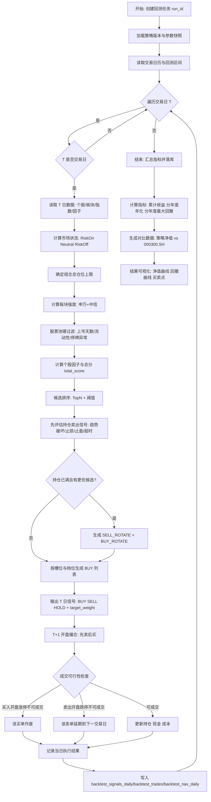
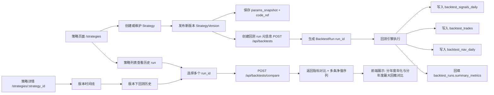

# 量化策略与回测系统设计（基于现有 DB 数据）

## 1. 目标

基于当前项目已有数据（交易日历、个股日线/日指标/技术因子、申万/中信板块、大盘指数、指数因子），构建一个可落地的日频多因子选股与回测框架，支持：

1. 每日全市场扫描并生成买卖信号。
2. 生成具体仓位建议（买入金额/股数、减仓比例、止损止盈）。
3. 回测输出净值、最大回撤、收益、交易明细等核心指标。
4. 前端展示回测曲线、买卖点、回撤曲线与交易记录。

本文是策略与系统设计文档，不包含代码实现。

---

## 2. 数据前提与约束

## 2.1 可用数据（按 DB.md）

1. 个股：
- `raw/daily`：OHLCV、涨跌幅（历史完整）。
- `raw/daily_basic`：估值、换手率、市值等（历史完整）。
- `raw/daily_limit`：涨跌停价格（`up_limit/down_limit`，历史完整，可用于可成交性判断）。
- `features/indicators`：MA/MACD/KDJ/RSI/BOLL/ATR/CCI/WR/量比等（历史完整）。
- `adj_factor`（DuckDB）：复权因子（当前库存覆盖较短，不作为首版统一回测口径依赖）。

2. 板块与指数：
- `shenwan_daily`、`citic_daily`：板块日行情 + 排名。
- `market_index_dailybasic`：大盘指数估值/市值等。
- `index_factor_pro`：大盘/申万/中信指数技术因子。

3. 交易辅助：
- `trade_calendar`：交易日历（SSE）。
- `daily_signal`：历史遗留信号集合（本方案不复用，走新集合）。

## 2.2 约束与说明

1. 当前无财报三表（利润表/资产负债表/现金流），因此“基本面”以估值与市场行为代理因子实现。
2. 策略采用日频，默认 `T` 日收盘后生成信号，`T+1` 开盘成交。
3. 默认回测区间：`20100104` 到 `20260206`（以交易日历开市日为准）。

## 2.3 价格口径与撮合口径（已确认）

结合现有数据存储现状（`features/indicators` 为 `qfq` 技术指标，`raw/daily` 与 `raw/daily_limit` 覆盖完整），首版统一如下：

1. 因子计算与信号打分：使用 `features/indicators`（`qfq` 口径）。
2. 撮合成交价格：使用 `raw/daily` 的 `T+1` 开盘价（真实交易口径）。
3. 涨跌停可成交性：使用 `raw/daily_limit` 的 `up_limit/down_limit` 判断。
4. 持仓市值与净值：使用 `raw/daily` 收盘价盯市。
5. 不单独引入复权现金流修正（分红送转细节）作为首版能力，后续再增强。

---

## 3. 策略总体架构

采用四层框架：

1. 市场状态层（Market Regime）  
决定总仓位上限（风险开关）。

2. 板块趋势层（Sector Trend）  
优先选择强板块，避免逆板块交易。

3. 个股因子层（Stock Factors）  
对个股做多因子打分，产生候选池与排序。

4. 组合与风控层（Portfolio + Risk）  
执行仓位分配、止损止盈、换仓规则。

---

## 4. 因子设计

## 4.1 市场状态因子（大盘风控）

基于 `000300.SH`、`000001.SH` 及板块广度构建三档风险状态：

1. `RiskOn`（进攻）：
- `close > MA20 > MA60`
- `MACD` 柱为正或 DIF 上穿 DEA
- 近 5 日申万一级板块上涨家数占比 >= 60%

2. `Neutral`（中性）：
- 趋势不一致，或板块广度在 40%-60%

3. `RiskOff`（防守）：
- `close < MA60` 且 `MACD` 弱势
- 近 5 日板块上涨占比 <= 40%

输出：`market_regime_score` in {1.0, 0.7, 0.4}，作为总仓位上限乘数。

## 4.2 板块趋势因子（申万+中信）

按日计算板块强度，并映射到个股：

1. 板块强度 `sector_strength`：
- 20 日动量（`pct_chg_20d`）
- 5 日动量（`pct_chg_5d`）
- 排名因子（`rank`、`rank_avg_5d`，越靠前越强）

2. 归一化后加权：
- `0.5 * rank_score + 0.3 * mom_20d_score + 0.2 * mom_5d_score`

3. 个股映射：
- 使用“当前最新行业归属”做映射（不做历史时点回溯）；
- 优先取申万三级行业；
- 若缺失可回落到中信行业映射；
- 同时保留申万与中信两个分数，取加权平均。

## 4.3 个股“基本面代理”因子

使用 `daily_basic + indicators` 的可得字段：

1. 估值因子（行业内分位）：
- 低 `PE_TTM`、低 `PB` 得高分（分位逆序）。

2. 流动性因子：
- `amount_20d_avg`、`turnover_rate_20d_avg`（剔除极端冷门票）。

3. 稳定性因子：
- `ATR / close` 越低，分数越高（降低噪声票）。

4. 资金活跃因子：
- `volume_ratio`、`turnover_rate` 在合理区间加分（防止无量突破）。

## 4.4 个股趋势/技术因子

1. 趋势结构：
- `MA20 > MA60`，`close > MA20`。

2. 动量确认：
- `MACD` 金叉或柱状图连续抬升。
- `RSI12` 在 `[50, 80]` 区间优先。

3. 位置与突破：
- 近 20 日新高突破 + 成交量放大（`volume_ratio > 1.2`）。

4. 过热抑制：
- `RSI12 > 85` 或单日涨幅过大（如 > 9%）降分/禁买。

---

## 5. 综合评分与选股逻辑

## 5.1 股票池过滤（硬条件）

每日扫描全量 A 股后，先过滤：

1. 上市天数 < 120 交易日剔除。
2. 最近 20 日平均成交额 < 3000 万剔除。
3. 当日停牌、无行情、异常数据剔除。
4. 涨跌停可成交性不在此处预剔除，统一在 `T+1` 撮合层处理。

## 5.2 综合打分

`total_score = 0.35*stock_trend + 0.25*sector_strength + 0.25*value_quality + 0.15*liquidity_stability`

输出分数标准化到 `[0, 100]`。

## 5.3 买入信号

满足：

1. `market_regime_score >= 0.4`（非极端风控）。
2. `total_score >= buy_threshold`（首版默认 75）。
3. 在当日排名前 `N`（首版默认 20）且不在持仓中。

生成 `BUY`，并给出目标仓位（见第 7 节）。

## 5.4 卖出信号

任一触发即 `SELL`：

1. 趋势破坏：`close < MA20` 且 `MACD` 转弱。
2. 止损：从买入价回撤超过 `stop_loss_pct`（默认 8%）。
3. 跟踪止盈：从最高价回撤超过 `trail_stop_pct`（默认 10%）。
4. 板块退潮：所属板块强度跌出后 40% 分位且持仓收益转弱。
5. 持有超时：持仓超过 `max_hold_days`（默认 40）且分数低于中位数。
6. 轮动卖出（`SELL_ROTATE`）：当组合已满仓位槽位且出现更优新标的时，允许卖出“质量最差且盈利不高”的持仓，腾挪到更优标的。

轮动触发规则（首版）：

1. 当前持仓数已达 `max_positions`（默认 5）。
2. 候选买入最高分 `candidate_score` 与最弱持仓分 `worst_holding_score` 差值超过 `rotate_score_delta`（默认 8 分）。
3. 最弱持仓当前收益率 `<= rotate_profit_ceiling`（默认 5%），即“盈利不特别好”。
4. 最弱持仓不在强制持有冷静期（`min_hold_days_before_rotate`，默认 3 日）。

---

## 6. 每日全市场扫描流程（回测主循环）

对交易日历中的每个开市日 `T`：

1. 读取 `T` 日可用行情、指标、板块与市场状态数据。
2. 执行股票池过滤。
3. 计算四类因子分数与综合分数。
4. 对当前持仓先生成卖出信号。
5. 按资金约束和风控上限生成买入列表。
6. 输出 `T` 日信号表：
- `ts_code`
- `signal` (`BUY`/`SELL`/`HOLD`)
- `score`
- `target_weight`
- `target_amount`
- `reason_codes`

执行假设：`T` 日信号在 `T+1` 开盘成交。

成交可行性规则（涨跌停）：

1. `BUY`：若 `T+1` 开盘即涨停且无法成交，则该买单作废（不追单到下一日）。
2. `SELL`：若 `T+1` 开盘即跌停且无法成交，则该卖单延期，下一交易日继续尝试。
3. 可成交性判断数据源：`raw/daily_limit`（`up_limit/down_limit`）。
4. 最小交易单位：A 股按 `100` 股整数倍下单。

---

## 7. 资金分配与仓位管理（100万人民币）

## 7.1 组合约束（按你的确认）

1. 初始资金固定：`1,000,000` 人民币。
2. 最大持仓数：`5` 只股票。
3. 使用“仓位档位”控制每只股票目标仓位。

## 7.2 仓位档位模型（首版固定）

采用“槽位 + 档位”方式，避免总仓位冲突：

1. 单槽位基准仓位：`20%`（因为最多 5 只）。
2. 档位：`25% / 50% / 75% / 100%`（相对于单槽位）。
3. 对应总资金权重：
- `25% 档` = `5%` 总资金（5万元）
- `50% 档` = `10%` 总资金（10万元）
- `75% 档` = `15%` 总资金（15万元）
- `100% 档` = `20%` 总资金（20万元）

仓位档位映射规则（首版）：

1. `score >= 90`：`100% 档`
2. `85 <= score < 90`：`75% 档`
3. `80 <= score < 85`：`50% 档`
4. `75 <= score < 80`：`25% 档`

## 7.3 组合层总仓位上限（市场状态）

在槽位目标基础上再乘以市场状态上限：

1. `RiskOn`：100%
2. `Neutral`：70%
3. `RiskOff`：40%

即：最终目标仓位 = 槽位仓位 × 市场状态系数。

## 7.4 主动轮动换仓（无显式卖出信号也可换）

满足以下条件可触发“卖弱买强”：

1. 当前持仓已满 5 只。
2. 出现新候选股票评分显著更高。
3. 被替换持仓近期表现不佳（收益率不高、评分靠后）。

执行方式：

1. `T` 日生成配对信号：`SELL_ROTATE(弱)` + `BUY_ROTATE(强)`。
2. `T+1` 开盘先尝试卖出弱票，成交后再买入强票。
3. 若卖出失败（跌停无法成交），则整组轮动取消，次日重算。

## 7.5 交易成本与滑点（首版简化）

默认参数（可配置）：

1. 佣金：`0`
2. 印花税：`0`
3. 过户费：`0`
4. 滑点：`0`

---

## 8. 回测输出数据结构设计

首版统一使用 MongoDB 存储回测结果（`strategy_*` / `backtest_*`）。

## 8.1 `backtest_runs`

记录一次回测任务元信息：

1. `run_id`
2. `strategy_id`
3. `strategy_version_id`
4. `params_snapshot`
5. `start_date`, `end_date`
6. `initial_capital`
7. `created_at`, `status`

## 8.2 `backtest_nav_daily`

每日净值与风控轨迹：

1. `run_id`, `trade_date`
2. `nav`, `cash`, `position_value`
3. `daily_return`, `cum_return`
4. `drawdown`, `exposure`
5. `benchmark_nav`（如沪深300）

## 8.3 `backtest_trades`

逐笔成交明细：

1. `run_id`, `trade_date`, `ts_code`
2. `side` (`BUY`/`SELL`)
3. `price`, `shares`, `amount`
4. `fee=0`, `slippage_cost=0`（首版固定）
5. `reason_codes`
6. `signal_score`

## 8.4 `backtest_positions_daily`

每日持仓快照：

1. `run_id`, `trade_date`, `ts_code`
2. `shares`, `cost_price`, `market_price`
3. `market_value`, `pnl`, `weight`
4. `holding_days`

## 8.5 `backtest_signals_daily`

每日全量扫描信号（必存，便于复盘与回测对比）：

1. `run_id`, `trade_date`, `ts_code`
2. `signal`, `score`
3. `target_weight`, `target_amount`
4. `factor_breakdown`（json）

---

## 9. 回测指标（页面展示）

首版页面与对比聚焦：

1. 累计收益率
2. 分年度年化收益率
3. 分年度最大回撤

---

## 10. 前端展示需求（回测页面）

## 10.1 图表

1. 净值曲线（策略 vs 基准）
2. 回撤曲线（面积图）
3. 仓位利用率曲线
4. 买卖操作标记：
- 在净值图上标记“净买入日/净卖出日”
- 点击日期可查看当日交易明细

## 10.2 表格

1. 交易明细表（可按股票/日期过滤）
2. 持仓变动表
3. 指标汇总卡片（累计收益、分年年化、分年最大回撤）

## 10.3 个股复盘联动（建议）

从交易明细点击股票可跳转个股 K 线页并带回测买卖点叠加。

---

## 11. 默认参数建议（首版）

1. `buy_threshold`: 75
2. `sell_threshold`: 50（用于弱化持仓淘汰）
3. `stop_loss_pct`: 0.08
4. `trail_stop_pct`: 0.10
5. `max_hold_days`: 40
6. `min_avg_amount_20d`: 30000000
7. `max_positions`: 5
8. `slot_weight`: 0.20
9. `position_levels`: `[0.25, 0.5, 0.75, 1.0]`
10. `market_exposure`: `{risk_on:1.0, neutral:0.7, risk_off:0.4}`
11. `rotate_score_delta`: 8
12. `rotate_profit_ceiling`: 0.05
13. `min_hold_days_before_rotate`: 3
14. `sector_max`: 0.40
15. `slippage_bps`: 0

---

## 12. 回归测试与稳定性验证（Regression）

为保证策略可迭代，首版固定以下回归集：

1. 时间分段回测：
- 2010-2015
- 2016-2019
- 2020-2022
- 2023-2026

2. 市场状态覆盖：
- 单边牛市、震荡市、下跌市分别统计指标。

3. 稳定性阈值（首版）：
- 任一年度年化收益率不得较上版劣化超过 20%（同区间对比）。
- 任一年度最大回撤不得较上版扩大超过 20%。
- 交易次数变化不超过 ±30%（参数未变场景）。

---

## 13. 实施优先级（不含开发）

1. `MVP`：
- 市场状态 + 板块趋势 + 个股趋势
- 固定仓位法（先不启用 ATR 风险预算）
- 回测曲线 + 交易明细 + 最大回撤

2. `V2`：
- 加入估值/流动性代理因子
- 加入 ATR 风险预算仓位
- 完整绩效分析（分年收益、分年回撤、交易统计）

3. `V3`：
- 因子权重自动调参
- 多策略组合（稳健/进攻）并行回测

---

## 14. 关键结论

在当前数据条件下，可以落地一个可解释、可回测、可视化完整的日频全市场选股系统。  
核心是先建立“市场风控 + 板块趋势 + 个股趋势”的主干框架，再逐步增强基本面代理因子和资金分配精细化逻辑。

---

## 15. 程序架构改造总览（实现层）

为了把第 1-14 节策略设计落地到系统，需要新增一套“策略管理 + 回测执行 + 结果存储 + 可视化 API”架构。

实现分层建议：

1. 数据层：统一读取 Parquet + MongoDB，提供标准 DataFrame/Record 接口。
2. 因子层：市场、板块、个股因子计算模块化。
3. 信号层：打分、阈值、买卖信号输出。
4. 组合层：仓位分配、风险约束、调仓。
5. 回测执行层：撮合、成本、净值更新、指标统计。
6. 应用层：策略管理 API、回测管理 API、前端查询 API。

---

## 16. 后端目录与模块改动建议

建议新增目录（与现有 `backend/app` 结构兼容）：

1. `backend/app/quant/`
- `engine.py`：回测主引擎（逐日循环）。
- `execution.py`：订单撮合、可成交性判断（含涨跌停/最小成交单位）。
- `portfolio.py`：持仓账户状态机。
- `metrics.py`：收益、回撤、分年指标计算。
- `risk.py`：仓位与风控规则。
- `context.py`：单日上下文数据（market/sector/stock）。
- `registry.py`：策略注册与加载。
- `base.py`：策略接口（`prepare`, `score`, `signal`, `allocate`）。
- `factors_market.py`：市场状态因子。
- `factors_sector.py`：板块趋势因子。
- `factors_stock.py`：个股趋势/估值/流动性因子。
- `allocator.py`：仓位分配器（槽位 + 档位 + 轮动）。

2. `backend/app/data/` 新增数据访问文件
- `mongo_backtest.py`：回测运行、净值、交易、信号、持仓读写。
- `duckdb_backtest_store.py`：批量读取 Parquet 特征与行情（按日期/股票池）。

3. `backend/app/services/` 新增服务
- `strategy_service.py`：策略 CRUD、版本发布、参数校验。
- `backtest_service.py`：创建回测任务、读取结果、聚合统计。

4. `backend/app/api/routes/` 扩展
- 改造 `strategies.py`（当前占位）。
- 改造 `backtests.py`（当前占位）。

5. `backend/scripts/` 新增脚本
- `backend/scripts/backtest/run_backtest.py`：离线回测入口。
- `backend/scripts/daily/generate_signals.py`：每日全市场扫描信号（可替换/合并现有 `calculate_signal.py`）。

---

## 17. 策略管理设计（策略定义/版本/参数）

## 17.1 策略对象模型

建议将策略拆成三层对象：

1. `StrategyDefinition`
- `strategy_id`
- `name`
- `description`
- `author`
- `status`（active/inactive）

2. `StrategyVersion`
- `strategy_id + version`
- `factor_weights`
- `buy_rules`
- `sell_rules`
- `allocation_rules`
- `risk_rules`
- `created_at`

3. `StrategyRunConfig`
- `strategy_id`
- `version`
- `start_date/end_date`
- `initial_capital`
- `cost_model`
- `slippage_model`
- `benchmark`

## 17.2 参数治理

1. 每个策略版本保存完整参数快照（可复现）。
2. 参数使用 Schema 校验（Pydantic）。
3. 运行中参数不可变，禁止“边跑边改”。
4. 版本发布后只读，修改需新建版本号。

---

## 18. 回测执行流程（程序实现视角）

`BacktestEngine.run(run_config)` 标准流程：

1. 初始化账户：
- 现金、持仓、成本、统计缓存。

2. 构建交易日序列：
- 仅使用 `trade_calendar` 开市日。

3. 每个交易日 `T`：
- 加载 `T` 所需市场/板块/个股数据。
- 计算因子与综合分数。
- 生成卖出信号（先卖后买）。
- 生成买入候选与目标权重。
- 按风险约束计算目标股数。
- 在 `T+1` 开盘价执行撮合（固定规则）。
- 更新账户与持仓快照。
- 记录信号、交易、净值、回撤。

4. 回测结束：
- 计算汇总绩效指标。
- 写入 `backtest_runs` 最终状态。

---

## 19. 数据库设计补充（MongoDB）

在第 8 节基础上，补充索引与新增集合：

## 19.1 策略管理集合

1. `strategy_definitions`
- 唯一索引：`strategy_id`
- 普通索引：`status`, `updated_at`

2. `strategy_versions`
- 唯一索引：`strategy_id + version`
- 普通索引：`strategy_id`, `created_at`

## 19.2 回测集合索引建议

1. `backtest_runs`
- 唯一索引：`run_id`
- 普通索引：`strategy_id`, `created_at`, `status`

2. `backtest_nav_daily`
- 唯一索引：`run_id + trade_date`
- 普通索引：`run_id`, `trade_date`

3. `backtest_trades`
- 普通索引：`run_id + trade_date`
- 普通索引：`run_id + ts_code`

4. `backtest_positions_daily`
- 唯一索引：`run_id + trade_date + ts_code`

5. `backtest_signals_daily`
- 索引：`run_id + trade_date`
- 索引：`run_id + ts_code + trade_date`

## 19.3 大数据量策略

1. 保留全部 `run`。
2. 每个 `run` 保留全量 `backtest_signals_daily`，不做摘要替代裁剪。

---

## 20. API 设计补充

## 20.1 策略管理 API

1. `GET /api/strategies`：列表。
2. `POST /api/strategies`：新建策略定义。
3. `GET /api/strategies/{strategy_id}/versions`：版本列表。
4. `POST /api/strategies/{strategy_id}/versions`：发布新版本。
5. `POST /api/strategies/{strategy_id}/enable` / `disable`：启停。

## 20.2 回测 API

1. `POST /api/backtests`：创建回测 run 元信息（不直接执行）。
2. `GET /api/backtests`：任务列表。
3. `GET /api/backtests/{run_id}`：任务详情+汇总指标。
4. `GET /api/backtests/{run_id}/nav`：净值序列。
5. `GET /api/backtests/{run_id}/drawdown`：回撤序列。
6. `GET /api/backtests/{run_id}/trades`：交易明细。
7. `GET /api/backtests/{run_id}/positions`：持仓快照。
8. `GET /api/backtests/{run_id}/signals`：当日全量信号（分页）。

## 20.3 任务运行方式（首版）

1. 回测任务由后台手动执行 Python 脚本（`backend/scripts/backtest/run_backtest.py`）。
2. API 仅负责查询结果与管理策略，不引入异步任务框架，也不做任务排队。
3. 运行状态统一：`pending/running/success/failed`。

---

## 21. 前端程序改造补充

建议新增页面：

1. `/backtests`：回测任务列表 + 创建入口。
2. `/backtests/[run_id]`：回测详情页。

详情页模块：

1. 指标卡片：累计收益、分年度年化、分年度最大回撤。
2. 净值图：策略/基准 + 买卖标记。
3. 回撤图：区间 drawdown。
4. 交易表：支持按日期/股票过滤。
5. 信号表：支持查看某日扫描结果与因子分解。

---

## 22. 调度与任务编排

## 22.1 每日生产流程（收盘后）

1. 数据更新（你现有 `daily.sh` 流程）。
2. 生成当日全市场信号并写入新信号集合（不写 `daily_signal`）。
3. 可选手动执行“最近窗口回测刷新”（如最近 1 年滚动回测，非全历史）。

## 22.2 全历史回测流程

1. 由用户手动触发 `run_backtest.py`。
2. 回测任务由脚本前台执行，日志实时输出。
3. 结束后缓存摘要指标供前端快速读取。

---

## 23. 性能与工程实现要点

1. 数据读取：
- 尽量按“日期批次 + 股票池”读取，减少全表扫描。

2. 计算方式：
- 因子计算尽量向量化（pandas/duckdb SQL），避免 Python 双重循环。

3. 写入方式：
- 交易/信号/净值采用批量写入（bulk_write）。

4. 幂等性：
- 同一 `run_id` 重跑前先清理该 run 的明细集合。

5. 可观测性：
- 统一 logging，记录每阶段耗时与数据量。

6. 首版性能目标（基准机）：
- 历史全量回测（2010-01-01 至今，约 3900+ 交易日）单策略单版本在 `<= 2h` 内完成。
- 区间回测（最近 1 年）在 `<= 8min` 内完成。
- `GET /api/backtests/{run_id}` P95 `< 300ms`，`GET /api/backtests/{run_id}/nav` P95 `< 800ms`。
- 回测详情页首屏（指标卡 + 净值图）接口总耗时 P95 `< 1.5s`。

---

## 24. 测试与回归补充（程序层）

1. 单元测试：
- 因子函数、仓位分配、手续费计算、回撤计算。

2. 集成测试：
- 小时间窗口（例如 3 个月）端到端回测，校验结果字段完整性。

3. 回归测试：
- 固定策略版本 + 固定区间，结果误差应在容忍范围内。

4. 数据一致性检查：
- 交易日序列连续性。
- 信号与交易日期偏移关系（`T` 信号、`T+1` 成交）严格一致。

---

## 25. 建议实施顺序（程序改造）

1. 第一步：打通策略管理与回测任务模型（集合 + API + 占位执行器）。
2. 第二步：实现最小回测引擎（单策略、固定仓位、固定成本模型）。
3. 第三步：接入完整因子与仓位管理，输出全量信号。
4. 第四步：前端详情页与图表联调。
5. 第五步：回归测试基线固化。

---

## 26. 已确认事项与实现决策

根据你的反馈，本项目先按以下口径实施：

1. 集合命名统一：使用 `strategy_*` 与 `backtest_*`，不使用 `bt2_*`。
2. 回测状态统一：`pending/running/success/failed`。
3. 市场状态与仓位参数统一：`risk_on=1.0`、`neutral=0.7`、`risk_off=0.4`。
4. 代码目录统一：策略与回测核心放在 `backend/app/quant/`。
5. 涨跌停可成交性统一在撮合层判断，不在股票池阶段预剔除。
6. 行业映射口径：使用“当前最新行业归属”映射历史样本。
7. 价格口径（结合现有数据）：
- 信号与因子：`qfq` 指标。
- 成交与盯市：`raw/daily`。
- 涨跌停判断：`raw/daily_limit`。
8. A 股交易规则：最小买卖单位 `100` 股；涨跌停参考 `raw/daily_limit`。
9. 首版交易成本：佣金/印花税/过户费/滑点均为 `0`。
10. 轮动换仓规则：若卖出腿失败，则整组轮动取消。
11. 数据保留：保留全部 `run`，且每个 `run` 保留全量信号。
12. 回测效果对比：按“每年年化 + 每年最大回撤”为核心指标。
13. 权限边界：首版不做细粒度权限控制，登录用户均可查看。
14. 任务执行：回测通过后台手动执行 Python 脚本，不引入异步任务框架。
15. 不改造现有 `daily_signal`：新开独立空间开发，完成后弃用旧链路。
16. 暂不支持同一策略版本多仓位模型并存：先固定为“槽位+档位+轮动”单模型。
17. 组合管理明确：
- 总资金 `100万`。
- 最多 `5` 只持仓。
- 仓位档位 `25%/50%/75%/100%`（相对于单槽位 20%）。
- 允许无显式卖出信号时执行“卖弱买强”轮动。

---

## 27. 策略中心设计（新增）

为满足“维护多个策略 + 每次变更新版本 + 可看历史回测并对比”的需求，新增“策略中心”。

## 27.1 菜单与页面结构

1. 顶层菜单新增 `策略`（`/freedom/strategies`）。
2. `策略列表页`（`/strategies`）：
- 展示所有策略卡片（名称、状态、最新版本、最近一次全历史回测结果）。
- 每个策略卡片下直接展示“历史回测记录列表”（最近 N 条）。
- 支持勾选多个回测记录进入“效果对比”。
3. `策略详情页`（`/strategies/{strategy_id}`）：
- 展示版本时间线（`v1/v2/v3...`）。
- 展示每个版本的回测历史（全历史 + 区间回测）。
4. `回测对比页`（`/backtests/compare`）：
- 支持同策略不同版本、或不同策略之间的回测对比。
- 对比内容：分年度年化、分年度最大回撤、净值曲线。

## 27.2 核心实体与关系

采用三层主模型：

1. `Strategy`（策略定义）
- 一个策略对应一种方法论（例如“多因子趋势增强”）。

2. `StrategyVersion`（策略版本）
- 每次改代码或参数都创建新版本，不覆盖旧版本。
- 版本保存完整参数快照与代码标识（如 `git_commit`）。

3. `BacktestRun`（回测运行记录）
- 每次执行回测生成一条 run，绑定到一个 `strategy_version_id`。
- run 下挂明细：信号、成交、持仓快照、净值序列。

关系：

1. `Strategy 1:N StrategyVersion`
2. `StrategyVersion 1:N BacktestRun`

## 27.3 MongoDB 集合建议（新空间）

1. `strategy_definitions`
- `strategy_id`（唯一）
- `name`（唯一）
- `description`
- `status`（active/inactive）
- `owner`
- `created_at`, `updated_at`

2. `strategy_versions`
- `strategy_version_id`（唯一）
- `strategy_id`
- `version`（如 `v3`）
- `params_snapshot`（完整参数 JSON）
- `code_ref`（`git_commit` / tag / branch）
- `change_log`
- `created_by`, `created_at`
- 唯一索引：`(strategy_id, version)`

3. `backtest_runs`
- `run_id`（唯一）
- `strategy_id`, `strategy_version_id`
- `run_type`（首版：`full_history` / `range`；`rolling` 预留）
- `start_date`, `end_date`
- `initial_capital`
- `status`（pending/running/success/failed）
- `summary_metrics`（`total_return`, `annual_returns`, `annual_max_drawdowns`, `start_nav`, `end_nav`, `benchmark_total_return`, `trade_count`, `win_rate`）
- `created_at`, `finished_at`, `error_message`
- 索引：`(strategy_id, created_at)`、`(strategy_version_id, created_at)`

4. `backtest_nav_daily`
- `run_id`, `trade_date`
- `nav`, `cash`, `position_value`, `drawdown`, `benchmark_nav`
- 唯一索引：`(run_id, trade_date)`

5. `backtest_trades`
- `run_id`, `trade_date`, `ts_code`, `side`, `price`, `qty`, `amount`
- `signal_type`（BUY/SELL/SELL_ROTATE/BUY_ROTATE）
- 索引：`(run_id, trade_date)`、`(run_id, ts_code)`

6. `backtest_signals_daily`
- `run_id`, `trade_date`, `ts_code`
- `score`, `signal`, `target_weight`, `reason_codes`
- 唯一索引：`(run_id, trade_date, ts_code)`

## 27.4 不可变与追溯规则

1. 已发布 `strategy_version` 不可修改，只能新增版本。
2. 已完成 `backtest_run` 的结果不可覆盖，只能新建 run。
3. 页面“历史记录”默认按 `created_at DESC` 展示。
4. 所有图表、指标都必须可追溯到 `run_id -> strategy_version_id -> params_snapshot -> code_ref`。

## 27.5 API 设计补充

1. `GET /api/strategies`
- 返回策略列表 + 每个策略最近一次 run 摘要。

2. `POST /api/strategies`
- 创建新策略。

3. `GET /api/strategies/{strategy_id}/versions`
- 返回版本列表（含最近回测摘要）。

4. `POST /api/strategies/{strategy_id}/versions`
- 创建新版本（参数快照 + 代码引用）。

5. `GET /api/backtests?strategy_id=...&strategy_version_id=...`
- 查询回测历史记录。

6. `POST /api/backtests`
- 创建回测 run 元信息（必须带 `strategy_version_id`，不直接执行）。

7. `POST /api/backtests/compare`
- 输入多个 `run_id`，返回分年度年化、分年度最大回撤与多条净值序列。

## 27.6 与现有系统的边界

1. 不改造旧 `daily_signal` 链路。
2. 新策略中心与回测系统统一使用 `strategy_*` 与 `backtest_*` 集合。
3. 旧页面可继续运行；新页面独立接入新 API。

## 27.7 策略代码目录建议

当前阶段建议将策略与回测实现放在 `backend` 内部，不新建与 `backend` 平级的独立 `quant/` 目录。

推荐目录：

1. `backend/app/quant/`
- 策略与回测核心：`engine`、`factors`、`portfolio`、`execution`、`metrics`。

2. `backend/scripts/backtest/`
- 运行入口脚本：全历史回测、区间回测、每日扫描。

3. `backend/app/data/`
- `strategy_* / backtest_*` 数据访问层：run/signal/trade/nav 的 repository。

这样设计的原因：

1. 直接复用现有配置与基础设施（`settings`、Mongo 连接、日志、认证、API 路由）。
2. 部署与运维最简单（沿用现有 backend 镜像与启动方式）。
3. 避免早期出现 `PYTHONPATH`、依赖拆分、跨服务调试成本。

后续再拆分为与 `backend` 平级的 `quant/` 服务，仅在以下条件满足时进行：

1. 需要独立部署与扩缩容（计算任务与 API 生命周期明显不同）。
2. 量化模块依赖显著变重，影响 backend 构建体积或启动速度。
3. 需要独立发布节奏，或该引擎被多个项目复用。

---

## 28. 量化策略执行流程图

## 28.1 流程图对应的实现要点

1. 先“定风险仓位上限”（市场状态）再“做选股排序”，避免先选完再硬砍仓位。
2. 卖出优先于买入，且轮动换仓属于卖出与买入的成对操作。
3. 信号与成交解耦：`T` 产信号，`T+1` 开盘撮合。
4. 每日必须落库三类结果：信号、成交、净值，保证页面可追溯与可对比。

---

## 29. 策略中心数据流图（版本与对比）

## 29.1 数据治理规则（配合图 29）

1. `StrategyVersion` 一经发布不可修改，只能新增。
2. `BacktestRun` 成功后不可覆盖，只能新建 run。
3. 对比必须基于 `run_id`，不得直接用“策略名最新结果”替代。
4. 页面上所有结果都可追溯到 `strategy_id -> strategy_version_id -> run_id`。

---

## 30. 首版功能列表（开发范围）

`P0`（必须实现）：

1. 策略中心：
- 策略列表页（可见策略、最新版本、最近回测摘要）。
- 版本列表页（同策略多版本管理）。

2. 回测执行：
- 手动脚本触发全历史或区间回测。
- 严格执行 `T` 信号、`T+1` 开盘撮合规则。
- 涨跌停可成交性校验（`raw/daily_limit`）。
- 最小成交单位 `100` 股。

3. 结果落库：
- `backtest_runs`、`backtest_nav_daily`、`backtest_trades`、`backtest_positions_daily`、`backtest_signals_daily`。
- 每个 `run` 保存全量信号。

4. 查询与展示：
- 回测列表与详情 API。
- 详情页展示累计收益、分年度年化、分年度最大回撤、净值图、回撤图、交易表、信号表。
- 支持多 `run_id` 对比（分年度年化 + 分年度最大回撤 + 净值曲线）。

`P1`（后续增强）：

1. 复权现金流修正（分红送转精细化）。
2. 异步任务与队列调度。
3. 更丰富绩效指标（夏普、卡玛、盈亏比等）。

---

## 31. 模块职责与边界（开发指引）

1. `backend/app/quant/engine.py`
- 逐交易日主循环与状态推进。
- 不负责直接访问 Mongo/Parquet 文件。

2. `backend/app/quant/execution.py`
- `T+1` 成交模拟。
- 涨跌停可成交判断与 `100` 股取整。

3. `backend/app/quant/portfolio.py`
- 现金、持仓、成本、权重、持有天数管理。
- 卖出优先、轮动成对执行。

4. `backend/app/quant/factors_*.py`
- 市场、板块、个股因子计算。
- 仅输出标准化分数字段，不做写库。

5. `backend/app/data/duckdb_backtest_store.py`
- 统一读行情/因子/涨跌停数据。
- 屏蔽 Parquet 分区细节。

6. `backend/app/data/mongo_backtest.py`
- 统一写读 `strategy_*` 与 `backtest_*`。
- 负责索引初始化与幂等写入。

7. `backend/app/services/strategy_service.py`
- 策略定义、版本发布、参数校验。

8. `backend/app/services/backtest_service.py`
- 回测结果查询、汇总、对比数据拼装。

模块依赖方向固定为：

1. `api/routes -> services -> quant/data`
2. `quant -> data`（只读）
3. `services -> data`（读写）

---

## 32. 核心数据契约（首版固定）

## 32.1 `backtest_runs`

必填字段：

1. `run_id`（字符串，唯一）
2. `strategy_id`
3. `strategy_version_id`
4. `run_type`（`full_history` / `range`）
5. `start_date`（YYYYMMDD）
6. `end_date`（YYYYMMDD）
7. `initial_capital`（默认 1000000）
8. `status`（`pending/running/success/failed`）
9. `summary_metrics`（至少含 `total_return`, `annual_returns`, `annual_max_drawdowns`）

## 32.2 `backtest_signals_daily`

唯一键：

1. `(run_id, trade_date, ts_code)`

必填字段：

1. `signal`（`BUY/SELL/HOLD/BUY_ROTATE/SELL_ROTATE`）
2. `score`（0-100）
3. `target_weight`
4. `reason_codes`（数组）

## 32.3 `backtest_trades`

必填字段：

1. `side`（`BUY/SELL`）
2. `price`, `qty`, `amount`
3. `fee=0`, `slippage_cost=0`
4. `can_trade_reason`（如 `limit_up_blocked`, `limit_down_blocked`, `ok`）

## 32.4 `backtest_nav_daily`

必填字段：

1. `run_id`, `trade_date`
2. `nav`, `cash`, `position_value`
3. `drawdown`
4. `benchmark_nav`（`000300.SH`）

## 32.5 `backtest_positions_daily`

唯一键：

1. `(run_id, trade_date, ts_code)`

必填字段：

1. `run_id`, `trade_date`, `ts_code`
2. `shares`, `cost_price`, `market_price`
3. `market_value`, `pnl`, `weight`
4. `holding_days`

---

## 33. 开发任务拆分（可直接排期）

1. 任务 A：数据层
- 完成 `duckdb_backtest_store.py` 与 `mongo_backtest.py`。
- 建立全部 `strategy_*` 与 `backtest_*` 索引。

2. 任务 B：量化核心
- 完成 `engine.py`、`execution.py`、`portfolio.py`。
- 打通 `T -> T+1` 撮合链路。

3. 任务 C：策略层
- 完成 `registry.py` 与首个可运行策略实现。
- 固化参数 schema 与默认值。

4. 任务 D：脚本入口
- 实现 `backend/scripts/backtest/run_backtest.py`。
- 支持 `--strategy-id --strategy-version-id --start-date --end-date --initial-capital`。

5. 任务 E：API 与页面
- 完成策略/版本/回测查询 API。
- 完成策略列表、版本历史、回测详情、回测对比页。

6. 任务 F：回归与验收
- 跑固定区间回测，校验分年度指标输出。
- 校验页面与数据库结果一致。

---

## 34. 验收标准（DoD）

1. 正确性：
- 任意一个 `run_id` 可完整追溯策略版本、参数、信号、成交、净值。
- `T` 信号、`T+1` 成交关系在样本抽检中 100% 一致。

2. 完整性：
- 每个 `run` 都有 `signals/trades/nav/positions/runs` 五类数据。
- 每个 `run` 的 `backtest_signals_daily` 为全量股票覆盖（按当日可交易股票池）。

3. 一致性：
- API 返回的累计收益、分年年化、分年最大回撤与数据库计算一致。
- 对比页与详情页对同一 `run` 的指标一致。

4. 可运维性：
- 手动运行脚本可看到阶段日志（读取、打分、撮合、落库、汇总）。
- 回测失败时 `backtest_runs.status=failed` 且 `error_message` 有效。

---

## 35. 最终接口与前端契约（消除歧义）

本节用于固定首版实现口径，开发以本节为准。

## 35.1 回测触发模式（固定）

1. 首版唯一执行入口：`backend/scripts/backtest/run_backtest.py` 手动执行。
2. `POST /api/backtests` 保留，但仅用于“创建 run 元信息”，不直接触发回测执行。
3. 手动脚本支持传入已有 `run_id` 继续执行该 run（状态从 `pending` 置为 `running`）。
4. 脚本执行完成后回填 `backtest_runs.status`、`summary_metrics`、`finished_at`。
5. 不引入任务队列、worker、异步调度框架。

## 35.2 `summary_metrics` 固定结构

`backtest_runs.summary_metrics` 统一为以下 JSON 结构：

1. `total_return`: `float`
2. `annual_returns`: `dict[str, float]`，key 为年份（如 `"2024"`）
3. `annual_max_drawdowns`: `dict[str, float]`，key 为年份（如 `"2024"`）
4. `start_nav`: `float`
5. `end_nav`: `float`
6. `benchmark_total_return`: `float`
7. `trade_count`: `int`
8. `win_rate`: `float`

说明：

1. 前端首页和对比页只依赖 `total_return`、`annual_returns`、`annual_max_drawdowns`。
2. 其余字段用于详情页扩展和后续统计，不影响首版展示核心指标。

## 35.3 前端页面数据契约

## 35.3.1 策略列表页 `/strategies`

1. 数据源：`GET /api/strategies`
2. 每条策略最小返回字段：
- `strategy_id`
- `name`
- `status`
- `latest_version`
- `latest_run_id`
- `latest_summary.total_return`
- `latest_summary.annual_returns`
- `latest_summary.annual_max_drawdowns`

## 35.3.2 策略详情页 `/strategies/{strategy_id}`

1. 版本列表：`GET /api/strategies/{strategy_id}/versions`
2. 回测历史：`GET /api/backtests?strategy_id={strategy_id}`
3. 最小返回字段：
- `strategy_version_id`
- `version`
- `params_snapshot`
- `code_ref`
- `run_id`
- `start_date`, `end_date`
- `status`
- `summary_metrics`

## 35.3.3 回测详情页 `/backtests/{run_id}`

1. 指标卡：`GET /api/backtests/{run_id}`
2. 净值图：`GET /api/backtests/{run_id}/nav`
3. 回撤图：`GET /api/backtests/{run_id}/drawdown`
4. 交易表：`GET /api/backtests/{run_id}/trades?page=&page_size=`
5. 信号表：`GET /api/backtests/{run_id}/signals?trade_date=&page=&page_size=`

分页默认值（固定）：

1. `page` 默认 `1`
2. `page_size` 默认 `20`，最大 `200`

## 35.3.4 回测对比页 `/backtests/compare`

1. 数据源：`POST /api/backtests/compare`
2. 请求体：
- `run_ids: list[str]`
3. 约束：
- `run_ids` 长度 `2~5`（最多 5 个 run 同屏对比）
3. 响应体最小字段：
- `items[].run_id`
- `items[].strategy_id`
- `items[].strategy_version_id`
- `items[].summary_metrics.total_return`
- `items[].summary_metrics.annual_returns`
- `items[].summary_metrics.annual_max_drawdowns`
- `items[].nav_series`（日期+净值）

## 35.3.5 空态与错误态（固定）

1. 无数据：返回空数组，不返回 `null`。
2. 查询不到 `run_id`：HTTP `404`。
3. 参数错误：HTTP `400`，返回 `detail`。
4. 服务异常：HTTP `500`，返回统一错误信息。

默认筛选时间范围（前端固定）：

1. 回测列表页默认显示最近 `1` 年（可手动改区间）。

## 35.4 资金分配与下单规则（固定）

下单顺序与金额计算按以下顺序执行：

1. 当日先生成全部 `SELL`（含 `SELL_ROTATE`），再生成 `BUY`。
2. 买入候选排序键：
- 第一排序：`total_score DESC`
- 第二排序：`sector_strength DESC`
- 第三排序：`ts_code ASC`（稳定排序）
3. 单票目标权重：
- 由档位映射得到 `base_weight`
- 再乘 `market_exposure` 得 `target_weight`
- 再受 `sector_max` 约束
4. 目标金额：`target_amount = total_equity_t * target_weight`
5. 其中 `total_equity_t = cash_t + position_value_t`（当日调仓前账户总资产）。
6. 下单股数：
- `qty = floor(target_amount / open_price / 100) * 100`
- 若 `qty <= 0` 则跳过该买单
7. 现金约束：
- 按排序依次分配，现金不足则后续候选放弃
8. 轮动约束：
- `SELL_ROTATE` 未成交则对应 `BUY_ROTATE` 不执行（整组取消）

## 35.5 信号集合命名（固定）

1. 回测专用信号集合：`backtest_signals_daily`（按 `run_id` 隔离）。
2. 生产每日扫描信号集合：`strategy_signals_daily`（不带 `run_id`，按 `trade_date + strategy_id + strategy_version_id`）。
3. 两者禁止混用，页面查询回测时只读 `backtest_signals_daily`。

## 35.6 首版前端验收口径（固定）

1. 回测详情页必须显示：
- 累计收益
- 分年度年化
- 分年度最大回撤
- 策略净值曲线
- 交易明细
2. 回测对比页必须支持至少 2 个 `run_id` 同屏对比。
3. 所有分年度指标按自然年切分（`YYYY-01-01` 到 `YYYY-12-31`）。

## 35.7 脚本参数与状态流转（固定）

`run_backtest.py` 最小参数：

1. `--strategy-id`
2. `--strategy-version-id`
3. `--start-date`
4. `--end-date`
5. `--initial-capital`（默认 `1000000`）
6. `--run-id`（可选；不传则脚本先创建 run）

状态流转：

1. 创建后：`pending`
2. 开始执行：`running`
3. 成功结束：`success`
4. 异常退出：`failed`
